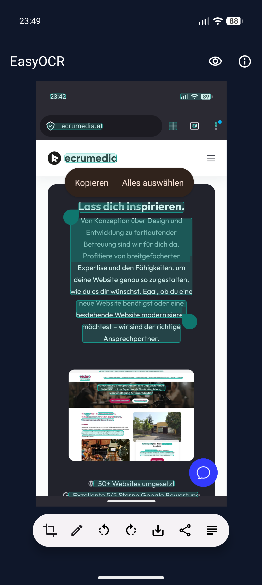
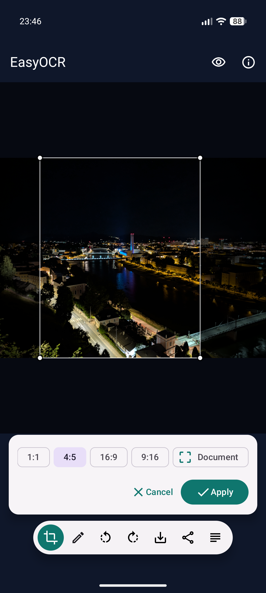
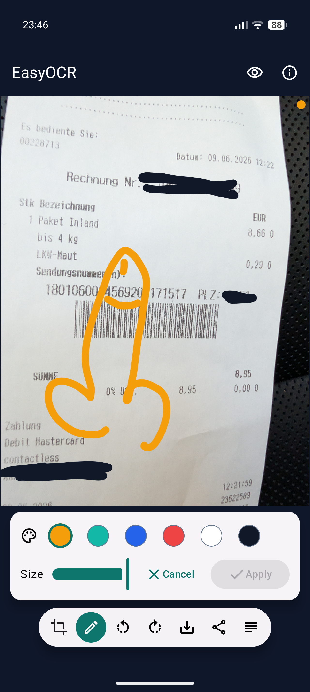

# EasyOCR

EasyOCR is an open-source, privacy-first Android image editor for copying text from screenshots. It is designed to appear in Android's screenshot/image editor flow: take a screenshot, tap the preview, choose EasyOCR, and select text directly on the image.

[](https://github.com/MosesEllermann/EasyOCR/releases/latest)

## Why EasyOCR Exists

I came from a phone setup where copying text from screenshots with Gemini/Google tools was built in and effortless. After moving to GrapheneOS, I missed that simple workflow, but I did not want to go back to Google services, cloud processing, or account-tied features just to copy text from an image.

EasyOCR is my open-source alternative: a small Android editor that opens screenshots, runs OCR locally, and lets you copy text without uploading the image anywhere.

## What It Does

- Opens screenshots from Android's **Edit with...** flow.
- Runs OCR locally on your device.
- Lets you select and copy detected text on top of the image.
- Supports pinch-to-zoom and pan.
- Includes crop, document perspective crop, rotate, drawing, save copy, and share tools.
- Works offline after installation.
- Built for privacy-conscious Android setups, including GrapheneOS.

## Screenshots

<p align="center">
  
  
  
</p>

## Privacy

OCR runs locally on your device. Images are not uploaded.

EasyOCR:

- does not request `INTERNET`
- does not include analytics
- does not include crash reporting
- does not include ads
- does not overwrite the original screenshot

The manifest only requests legacy `WRITE_EXTERNAL_STORAGE` for Android 8-9 save-copy support. Android 10 and newer use scoped storage through MediaStore.

## OCR

EasyOCR uses ML Kit Text Recognition v2 with the bundled Latin recognizer:

```kotlin
implementation("com.google.mlkit:text-recognition:16.0.1")
```

The recognizer runs on-device and is bundled with the app, so it does not need a Google account, cloud processing, runtime model download, or the `INTERNET` permission.

Notes:

- English and German are the default target languages.
- The bundled recognizer increases APK size compared with Play Services delivery.
- Tesseract and PaddleOCR are possible alternatives, but ML Kit is currently the most practical fit for this lightweight screenshot-editor workflow.

## Android Integration

EasyOCR registers as an image editor/viewer for:

- `android.intent.action.EDIT`
- `android.intent.action.VIEW`
- `android.intent.action.SEND`
- `image/*`, `image/png`, `image/jpeg`, and `image/webp`

Incoming `content://` images are opened through Android's `ContentResolver`. Persistable read permission is taken when the provider grants it.

## Build

Requirements:

- Android Studio with Android SDK Platform 36 installed
- JDK 17
- Gradle 9.4.1 or newer when building outside Android Studio

Build a debug APK:

```bash
./gradlew assembleDebug
```

Run tests and build a release APK:

```bash
./gradlew test assembleRelease
```

For a local signed release build, configure a private keystore through `local.properties`:

```properties
easyocr.release.storeFile=easyocr-release.jks
easyocr.release.storePassword=...
easyocr.release.keyAlias=easyocr
easyocr.release.keyPassword=...
```
## Notes

Android's screenshot preview/editor chooser differs a little by OS build and OEM. The important pieces for GrapheneOS are the `ACTION_EDIT` image intent filter, `image/*` MIME support, and content URI read handling, all of which are included here.

## Contributing

Contributions are very welcome. Ideas, bug reports, GrapheneOS/device testing notes, translations, UX improvements, OCR improvements, and pull requests all help make EasyOCR better.

If you want to work on something larger, opening an issue first is helpful so the direction can be discussed before you spend time on it.

## License

EasyOCR is open source under the Apache License 2.0. See [LICENSE](LICENSE).
